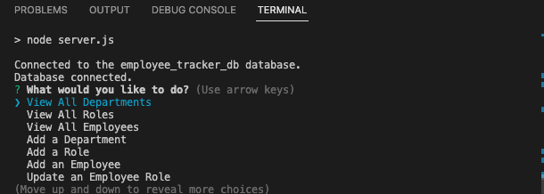

# SQL-employee-tracker

## Description

SQL Employee Tracker: This is an SQL employee database that easily allows users to navigate through different departments and roles of employees through simple command-line prompts. This project allowed me to sharpen my knowledge of SQL databases and using javascript to interactively add information to save to created databases with a smooth, user friendly application. Shout out to inquirer as well to allow this application to run in the command line and allow me to make use of prompts to streamline everything.

## Table of Contents 

- [Installation](#installation)
- [Usage](#usage)
- [License](#license)

## Installation
The user just has to create and populate the databases via SQL. Additional installation for this project is not needed as everything is ran through the integrated terminal. 

## Usage

1. Clone or install the zip.folder of the repository: [SQL employee tracker](https://github.com/Geidem/SQL-employee-tracker)
2. Open the repository in any source code editor.
3. Open the integrated terminal and run npm i to install the dependencies.
4. Run mysql -u root, and then source schema.sql to create the database, to populate the database run source seeds.sql exit mysql
5. Run npm start to begin the command line prompts process, and then simply follow along with the prompts and choices.

    

    
    

## License

MIT Licensing information for this project can be found in the LICENSE file associated with this repo.